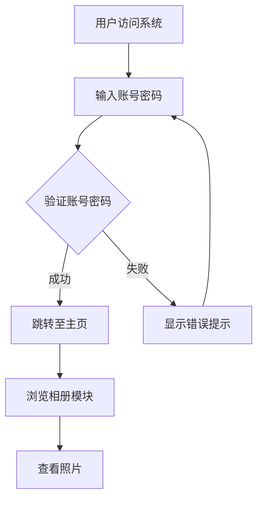
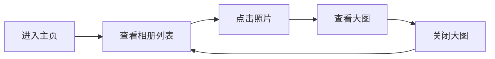

# 产品需求文档 (PRD)

## 1. 产品概述
一个基于 Vue + Element UI 的个人相册管理系统，支持用户登录后浏览和管理个人照片相册。系统采用简洁优雅的设计风格，为用户提供流畅的相册浏览体验。

- **主要目标**: 为用户提供一个简洁、美观、易用的个人相册管理平台
- **目标用户**: 个人用户，希望整理和展示自己的照片收藏

## 2. 核心功能

### 2.1 用户角色
| 角色 | 注册方式 | 核心权限 |
|------|---------|----------|
| 普通用户 | 固定账号密码登录 | 浏览相册、查看照片 |

### 2.2 功能模块
1. **登录页面**: 用户身份验证，固定账号密码登录
2. **主页**: 相册模块展示，支持照片浏览

### 2.3 页面详情
| 页面名称 | 模块名称 | 功能描述 |
|---------|---------|---------|
| 登录页 | 登录表单 | 用户名和密码输入框，固定账号密码验证 |
| 登录页 | 登录按钮 | 提交登录信息，验证通过后跳转到主页 |
| 主页 | 顶部导航栏 | 显示系统标题，包含退出登录功能 |
| 主页 | 相册模块 | 展示相册列表，支持照片预览和浏览 |
| 主页 | 照片展示区 | 网格布局展示照片，支持点击查看大图 |

## 3. 核心流程

### 3.1 用户登录流程
用户访问系统 → 输入固定账号密码 → 系统验证 → 登录成功跳转主页 → 浏览相册

### 3.2 相册浏览流程
进入主页 → 查看相册列表 → 点击照片查看大图 → 浏览照片详情

## 4. 用户界面设计

### 4.1 设计风格
- **主色调**: 采用 Element UI 默认主题色 #409EFF（蓝色）作为主色调，传达专业、可靠的感觉
- **辅助色**: 使用 #67C23A（绿色）表示成功状态，#F56C6C（红色）表示错误状态
- **背景色**: 采用 #F5F7FA 浅灰色背景，营造简洁、舒适的视觉感受
- **按钮风格**: 圆角按钮，主按钮使用主色调填充，次要按钮使用描边样式
- **字体**: 使用 Element UI 默认字体栈（-apple-system, BlinkMacSystemFont, "Segoe UI", Roboto 等）
- **布局**: 采用顶部导航 + 内容区域的经典布局方式
- **卡片样式**: 相册照片采用卡片式布局，带阴影和圆角，hover 时有轻微上浮效果

### 4.2 页面设计概览
| 页面名称 | 模块名称 | UI 元素 |
|---------|---------|---------|
| 登录页 | 登录表单 | 居中卡片布局，白色背景卡片，蓝色主题输入框，主色调登录按钮，表单验证提示 |
| 主页 | 顶部导航栏 | 深色背景（#001529），白色文字，左侧系统标题，右侧用户信息和退出按钮 |
| 主页 | 相册模块 | 网格布局照片卡片，每行 4 列，卡片包含照片预览、照片名称、hover 遮罩效果 |
| 主页 | 照片展示区 | 响应式网格，照片保持 16:9 比例，点击弹出大图查看器，支持关闭操作 |

### 4.3 响应式设计
- **桌面优先**: 优先设计桌面端体验，适合大屏幕照片浏览
- **移动端适配**: 在小屏幕设备上，相册网格自动调整为 2 列或单列布局
- **触摸优化**: 移动端支持滑动浏览照片，触摸友好的交互元素

### 4.4 交互细节
- 登录表单实时验证，输入框获得焦点时有蓝色边框高亮
- 登录按钮 hover 时有轻微颜色加深效果
- 照片卡片 hover 时有阴影加深和轻微上浮动画
- 照片点击后使用 Element UI 的 Dialog 组件展示大图
- 退出登录时显示确认对话框，防止误操作

## 5. 未来扩展
- 支持更多模块（如视频管理、文档管理等）
- 支持照片上传和删除功能
- 支持相册分类和标签管理
- 支持照片搜索和筛选