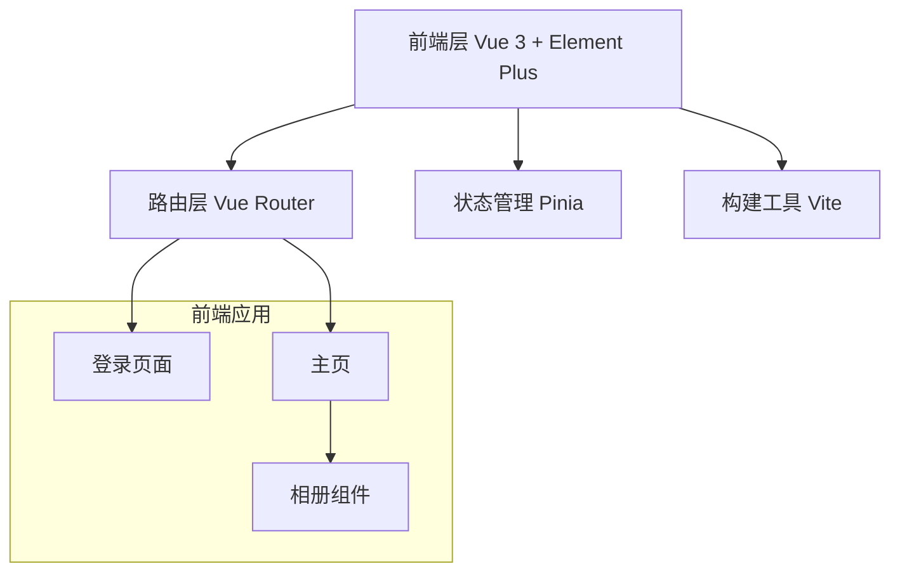
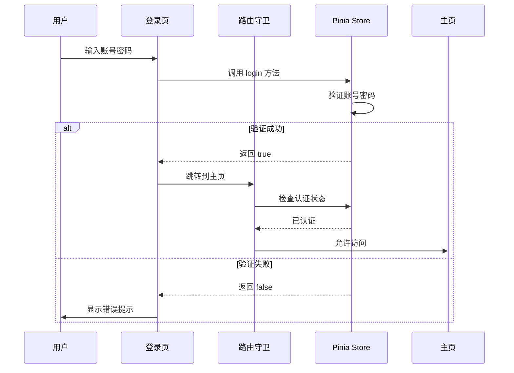

# 技术架构文档

## 1. 架构设计



## 2. 技术栈说明

### 2.1 核心技术栈
- **前端框架**: Vue 3.4+ (Composition API)
- **UI 组件库**: Element Plus 2.4+
- **构建工具**: Vite 5.0+
- **路由管理**: Vue Router 4.2+
- **状态管理**: Pinia 2.1+
- **样式方案**: CSS3 + Element Plus 主题定制

### 2.2 开发工具
- **包管理器**: npm / yarn / pnpm
- **代码规范**: ESLint + Prettier
- **IDE**: VSCode + Volar 插件

### 2.3 后端服务
- **当前阶段**: 无后端，使用固定账号密码验证
- **数据存储**: 前端 mock 数据
- **未来扩展**: 可对接 Node.js/Express 后端 API

## 3. 路由定义

| 路由路径 | 页面名称 | 权限要求 | 说明 |
|---------|---------|---------|------|
| `/login` | 登录页 | 公开访问 | 用户登录页面，固定账号密码验证 |
| `/` 或 `/home` | 主页 | 需要登录 | 主页面，展示相册模块 |
| `*` | 404 页面 | 公开访问 | 页面不存在时的提示页面 |

### 3.1 路由配置示例
```javascript
const routes = [
  {
    path: '/login',
    name: 'Login',
    component: () => import('@/views/Login.vue'),
    meta: { requiresAuth: false }
  },
  {
    path: '/',
    name: 'Home',
    component: () => import('@/views/Home.vue'),
    meta: { requiresAuth: true }
  },
  {
    path: '/:pathMatch(.*)*',
    name: 'NotFound',
    component: () => import('@/views/NotFound.vue')
  }
]
```

## 4. 数据模型

### 4.1 用户数据模型
```typescript
interface User {
  username: string
  password: string
  isAuthenticated: boolean
}

// 固定账号密码
const FIXED_USER = {
  username: 'admin',
  password: '123456'
}
```

### 4.2 相册数据模型
```typescript
interface Photo {
  id: number
  title: string
  url: string
  thumbnail: string
  description?: string
  createdAt: string
}

interface Album {
  id: number
  name: string
  photos: Photo[]
}
```

### 4.3 Mock 数据结构
```javascript
// 相册 mock 数据
const mockAlbums = [
  {
    id: 1,
    name: '旅行照片',
    photos: [
      {
        id: 1,
        title: '海边日落',
        url: '/photos/sunset.jpg',
        thumbnail: '/photos/sunset-thumb.jpg',
        description: '美丽的海边日落风景',
        createdAt: '2024-01-15'
      }
      // 更多照片...
    ]
  }
]
```

## 5. 项目目录结构

```
PChome/
├── public/                 # 静态资源目录
│   └── photos/            # 照片资源目录
├── src/
│   ├── assets/            # 资源文件（图片、字体等）
│   ├── components/        # 公共组件
│   │   ├── AlbumCard.vue # 相册卡片组件
│   │   └── PhotoViewer.vue # 照片查看器组件
│   ├── views/            # 页面组件
│   │   ├── Login.vue     # 登录页
│   │   ├── Home.vue      # 主页
│   │   └── NotFound.vue  # 404页面
│   ├── router/          # 路由配置
│   │   └── index.js
│   ├── store/           # 状态管理
│   │   ├── index.js
│   │   └── modules/
│   │       └── user.js  # 用户状态
│   ├── utils/           # 工具函数
│   │   └── auth.js      # 认证工具
│   ├── App.vue          # 根组件
│   └── main.js          # 应用入口
├── .env                 # 环境变量
├── .gitignore
├── index.html
├── package.json
└── vite.config.js       # Vite 配置
```

## 6. 状态管理设计

### 6.1 用户状态 (User Store)
```javascript
// store/modules/user.js
export const useUserStore = defineStore('user', {
  state: () => ({
    isAuthenticated: false,
    username: ''
  }),

  actions: {
    login(username, password) {
      // 验证固定账号密码
      if (username === 'admin' && password === '123456') {
        this.isAuthenticated = true
        this.username = username
        return true
      }
      return false
    },

    logout() {
      this.isAuthenticated = false
      this.username = ''
    }
  }
})
```

### 6.2 相册状态 (Album Store)
```javascript
// store/modules/album.js
export const useAlbumStore = defineStore('album', {
  state: () => ({
    albums: [],
    currentPhoto: null
  }),

  actions: {
    loadAlbums() {
      // 加载 mock 数据
      this.albums = mockAlbums
    },

    viewPhoto(photo) {
      this.currentPhoto = photo
    },

    closePhoto() {
      this.currentPhoto = null
    }
  }
})
```

## 7. 认证流程



## 8. 关键功能实现

### 8.1 登录验证
- 使用 Pinia store 管理用户认证状态
- 路由守卫拦截未认证访问
- localStorage 持久化登录状态

### 8.2 路由守卫
```javascript
router.beforeEach((to, from, next) => {
  const userStore = useUserStore()

  if (to.meta.requiresAuth && !userStore.isAuthenticated) {
    next('/login')
  } else if (to.path === '/login' && userStore.isAuthenticated) {
    next('/')
  } else {
    next()
  }
})
```

### 8.3 照片浏览
- 使用 Element Plus 的 Image 组件展示照片
- 支持 lazy loading 优化性能
- 点击查看大图，支持缩放和关闭

## 9. 性能优化策略

### 9.1 代码分割
- 路由懒加载，按需加载页面组件
- 第三方库按需引入

### 9.2 图片优化
- 使用缩略图预览，大图懒加载
- 图片压缩和格式优化
- 使用 WebP 格式提升加载速度

### 9.3 缓存策略
- 合理设置静态资源缓存
- 使用 Vite 的构建优化

## 10. 安全考虑

### 10.1 认证安全
- 前端路由守卫防止未授权访问
- 固定账号密码仅用于演示，生产环境需替换为真实认证系统

### 10.2 XSS 防护
- Vue 自动转义 HTML，防止 XSS 攻击
- 用户输入数据需经过验证和清理

## 11. 部署方案

### 11.1 构建命令
```bash
npm run build    # 构建生产版本
npm run preview  # 预览生产构建
```

### 11.2 部署方式
- 静态文件部署到 Nginx/Apache
- 支持 CDN 加速
- 未来可扩展为前后端分离架构

## 12. 扩展性设计

### 12.1 模块化设计
- 组件可复用，易于扩展新模块
- 路由配置支持动态添加新页面

### 12.2 未来扩展点
- 视频管理模块
- 文档管理模块
- 用户权限管理
- 后端 API 对接
- 数据库持久化